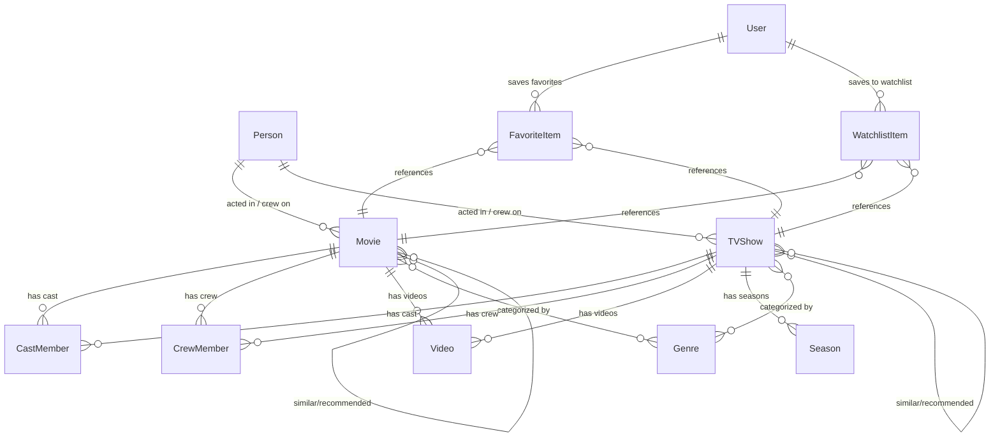

# Data Model: MovieNest

**Date**: 2026-09-18 | **Spec**: [spec.md](file:///d:/Projects/Front-end/MovieNest/specs/001-movie-series-explorer/spec.md)

## Overview

MovieNest has two data domains:
1. **Remote data** (TMDB API) — movies, TV shows, people, genres, videos, credits — fetched via TanStack Query, never stored locally
2. **Local data** (localStorage) — users, sessions, favorites, watchlist — managed via Zustand with persist middleware

---

## Remote Entities (TMDB API Responses)

### Movie

| Field | Type | Description | Nullable |
|-------|------|-------------|----------|
| id | number | TMDB movie ID (unique identifier) | No |
| title | string | Display title | No |
| original_title | string | Original language title | No |
| overview | string | Plot synopsis | Yes |
| poster_path | string \| null | Poster image path (append to image base URL) | Yes |
| backdrop_path | string \| null | Backdrop image path | Yes |
| release_date | string | Release date (YYYY-MM-DD format) | Yes |
| vote_average | number | Average rating (0–10 scale) | No |
| vote_count | number | Total vote count | No |
| popularity | number | TMDB popularity score | No |
| genre_ids | number[] | Genre ID array (list endpoints) | No |
| genres | Genre[] | Full genre objects (detail endpoint) | No |
| adult | boolean | Adult content flag | No |
| media_type | "movie" | Media type discriminator (for multi-search) | No |

**Detail-only fields** (available on `/movie/{id}`):

| Field | Type | Description | Nullable |
|-------|------|-------------|----------|
| tagline | string | Movie tagline | Yes |
| runtime | number \| null | Runtime in minutes | Yes |
| status | string | Release status (Released, Post Production, etc.) | No |
| budget | number | Production budget (USD, 0 if unknown) | No |
| revenue | number | Box office revenue (USD, 0 if unknown) | No |
| production_companies | ProductionCompany[] | Production companies | No |
| spoken_languages | SpokenLanguage[] | Spoken languages | No |
| homepage | string \| null | Official homepage URL | Yes |

---

### TVShow

| Field | Type | Description | Nullable |
|-------|------|-------------|----------|
| id | number | TMDB TV show ID | No |
| name | string | Display name | No |
| original_name | string | Original language name | No |
| overview | string | Show synopsis | Yes |
| poster_path | string \| null | Poster image path | Yes |
| backdrop_path | string \| null | Backdrop image path | Yes |
| first_air_date | string | First air date (YYYY-MM-DD) | Yes |
| vote_average | number | Average rating (0–10) | No |
| vote_count | number | Total vote count | No |
| popularity | number | TMDB popularity score | No |
| genre_ids | number[] | Genre ID array (list endpoints) | No |
| genres | Genre[] | Full genre objects (detail endpoint) | No |
| media_type | "tv" | Media type discriminator | No |

**Detail-only fields** (available on `/tv/{id}`):

| Field | Type | Description | Nullable |
|-------|------|-------------|----------|
| last_air_date | string \| null | Last air date | Yes |
| number_of_seasons | number | Total seasons | No |
| number_of_episodes | number | Total episodes | No |
| status | string | Show status (Returning Series, Ended, Canceled) | No |
| networks | Network[] | Broadcasting networks | No |
| seasons | Season[] | Season list | No |
| tagline | string | Show tagline | Yes |
| created_by | Creator[] | Show creators | No |
| episode_run_time | number[] | Typical episode runtimes | No |

---

### Person

| Field | Type | Description | Nullable |
|-------|------|-------------|----------|
| id | number | TMDB person ID | No |
| name | string | Display name | No |
| profile_path | string \| null | Profile image path | Yes |
| known_for_department | string | Primary department (Acting, Directing, etc.) | No |
| popularity | number | TMDB popularity score | No |
| media_type | "person" | Media type discriminator (for multi-search) | No |

**Detail-only fields** (available on `/person/{id}`):

| Field | Type | Description | Nullable |
|-------|------|-------------|----------|
| biography | string | Biography text | Yes |
| birthday | string \| null | Birth date (YYYY-MM-DD) | Yes |
| deathday | string \| null | Death date (YYYY-MM-DD) | Yes |
| place_of_birth | string \| null | Birth location | Yes |
| also_known_as | string[] | Alternative names | No |
| homepage | string \| null | Official homepage | Yes |
| gender | number | Gender (0=not set, 1=female, 2=male, 3=non-binary) | No |

---

### Genre

| Field | Type | Description | Nullable |
|-------|------|-------------|----------|
| id | number | Genre ID | No |
| name | string | Genre display name | No |

---

### Season

| Field | Type | Description | Nullable |
|-------|------|-------------|----------|
| id | number | Season ID | No |
| name | string | Season name (e.g., "Season 1") | No |
| overview | string | Season synopsis | Yes |
| poster_path | string \| null | Season poster | Yes |
| season_number | number | Season number (0 = specials) | No |
| episode_count | number | Number of episodes | No |
| air_date | string \| null | First episode air date | Yes |
| vote_average | number | Average rating | No |

---

### CastMember

| Field | Type | Description | Nullable |
|-------|------|-------------|----------|
| id | number | Person ID | No |
| name | string | Actor/actress name | No |
| character | string | Character name played | No |
| profile_path | string \| null | Profile image path | Yes |
| order | number | Billing order | No |

---

### CrewMember

| Field | Type | Description | Nullable |
|-------|------|-------------|----------|
| id | number | Person ID | No |
| name | string | Crew member name | No |
| job | string | Job title (Director, Writer, etc.) | No |
| department | string | Department (Directing, Writing, etc.) | No |
| profile_path | string \| null | Profile image path | Yes |

---

### Video

| Field | Type | Description | Nullable |
|-------|------|-------------|----------|
| id | string | Video ID | No |
| key | string | YouTube/Vimeo video key | No |
| name | string | Video title | No |
| site | string | Hosting site ("YouTube", "Vimeo") | No |
| type | string | Video type (Trailer, Teaser, Clip, Featurette) | No |
| official | boolean | Official video flag | No |

---

### Supporting Types

#### ProductionCompany

| Field | Type | Nullable |
|-------|------|----------|
| id | number | No |
| name | string | No |
| logo_path | string \| null | Yes |
| origin_country | string | No |

#### Network

| Field | Type | Nullable |
|-------|------|----------|
| id | number | No |
| name | string | No |
| logo_path | string \| null | Yes |

#### Creator

| Field | Type | Nullable |
|-------|------|----------|
| id | number | No |
| name | string | No |
| profile_path | string \| null | Yes |

#### SpokenLanguage

| Field | Type | Nullable |
|-------|------|----------|
| english_name | string | No |
| iso_639_1 | string | No |
| name | string | No |

---

### API Response Wrappers

#### PaginatedResponse\<T\>

| Field | Type | Description |
|-------|------|-------------|
| page | number | Current page number |
| results | T[] | Array of result items |
| total_pages | number | Total available pages |
| total_results | number | Total result count |

#### CreditsResponse

| Field | Type | Description |
|-------|------|-------------|
| id | number | Movie/TV show ID |
| cast | CastMember[] | Cast members |
| crew | CrewMember[] | Crew members |

#### VideosResponse

| Field | Type | Description |
|-------|------|-------------|
| id | number | Movie/TV show ID |
| results | Video[] | Video list |

#### CombinedCreditsResponse (Person filmography)

| Field | Type | Description |
|-------|------|-------------|
| id | number | Person ID |
| cast | (Movie \| TVShow)[] | Acting credits (with `media_type` discriminator) |
| crew | (Movie \| TVShow & { job: string; department: string })[] | Crew credits |

---

## Local Entities (localStorage)

### User

| Field | Type | Description | Validation |
|-------|------|-------------|------------|
| id | string | Unique user ID (generated UUID) | Auto-generated |
| name | string | Display name | Required, min 2 chars |
| email | string | Email address | Required, valid email format, unique across users |
| password | string | Password (plain text — demo only) | Required, min 6 chars |
| createdAt | string | Registration timestamp (ISO 8601) | Auto-generated |

**Storage key**: `movienest_users` (JSON array of User objects)

**Uniqueness rule**: Email MUST be unique across all registered users. Registration MUST fail with a clear error if email already exists.

---

### AuthSession

| Field | Type | Description |
|-------|------|-------------|
| user | Omit\<User, "password"\> | Current user (without password) |
| isAuthenticated | boolean | Authentication status |

**Storage key**: `movienest_auth` (single JSON object)

**Lifecycle**:
- Created on login/register
- Persisted across page refreshes via Zustand persist middleware
- Cleared on logout

---

### FavoriteItem

| Field | Type | Description |
|-------|------|-------------|
| id | number | TMDB content ID |
| mediaType | "movie" \| "tv" | Content type discriminator |
| title | string | Display title (movie title or TV show name) |
| posterPath | string \| null | Poster image path |
| voteAverage | number | Rating at time of save |
| releaseDate | string \| null | Release/air date |
| addedAt | string | Timestamp when favorited (ISO 8601) |

**Storage key**: `movienest_favorites_${userId}` (JSON array)

**Uniqueness rule**: Combination of `id` + `mediaType` MUST be unique per user. Adding a duplicate is a no-op (toggle to remove instead).

---

### WatchlistItem

| Field | Type | Description |
|-------|------|-------------|
| id | number | TMDB content ID |
| mediaType | "movie" \| "tv" | Content type discriminator |
| title | string | Display title |
| posterPath | string \| null | Poster image path |
| voteAverage | number | Rating at time of save |
| releaseDate | string \| null | Release/air date |
| addedAt | string | Timestamp when added (ISO 8601) |

**Storage key**: `movienest_watchlist_${userId}` (JSON array)

**Uniqueness rule**: Same as FavoriteItem — `id` + `mediaType` unique per user.

---

## Entity Relationships

## Data Flow Summary

| Domain | Source | Storage | Manager | Consumer |
|--------|--------|---------|---------|----------|
| Movies, TV, People, Genres | TMDB API | TanStack Query cache (in-memory) | TanStack Query hooks | React components |
| Auth sessions | User input | localStorage | Zustand authStore | AuthGuard, Navbar, pages |
| Favorites | User action | localStorage (per-user key) | Zustand favoritesStore | Favorites page, MediaCard |
| Watchlist | User action | localStorage (per-user key) | Zustand watchlistStore | Watchlist page, MediaCard |
| Theme preference | User toggle | localStorage | next-themes | _app.tsx, Tailwind `dark:` |
